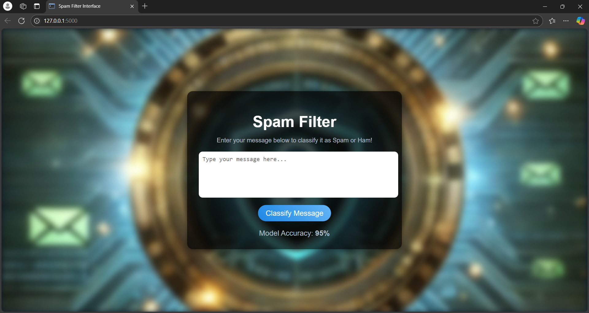
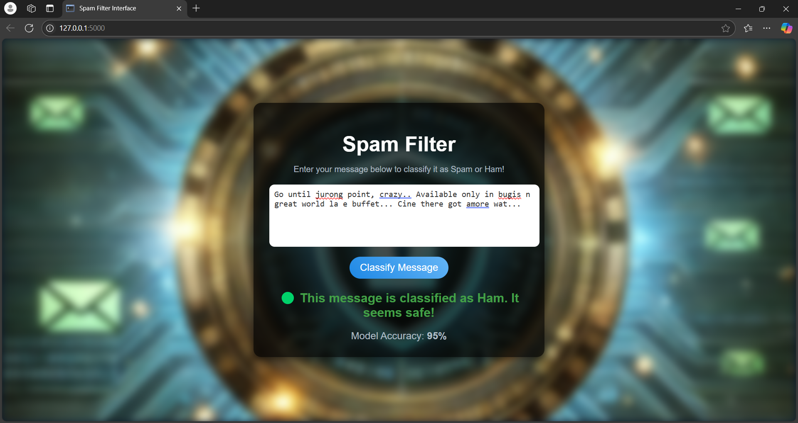

# SmartSpam: Intelligent Spam Filter System

# BRIEF EXPLANATION ABOUT THE WORKING MODEL:
The Spam Filter model utilizes machine learning algorithms to classify incoming emails as either spam or legitimate. By analyzing various features such as email content, subject lines, and sender information, the model identifies patterns that distinguish spam emails, providing an effective classification system for filtering unwanted messages.

# ML ALGORITHM USED:
### Multinomial Naive Bayes :
The Spam Filter model utilizes the Multinomial Naive Bayes algorithm, a probabilistic machine learning technique suited for text classification. The model uses a CountVectorizer to convert the email text into a numerical format based on word frequency, which is then used to train the Naive Bayes classifier. The classifier learns from a dataset of labeled "Spam" and "Ham" (non-spam) emails and calculates the probability of a given email being spam based on its content. After training, the model can classify new, unseen emails by predicting whether they are spam or legitimate.
# TECHNOLOGY USED FOR BUILDING THE FRONT-END:
### HTML & CSS :
The front-end of the Spam Filter application is developed using HTML, CSS, and JavaScript. HTML structures the content and user interface of the application, allowing users to interact with the spam classification tool. CSS is used to style the page, creating a visually appealing and responsive design. The JavaScript functionality allows real-time interaction, such as classifying the input message and displaying results dynamically on the page.

This front-end is integrated with the Flask framework, which serves the HTML page and handles backend interactions, such as receiving the input message, processing it, and returning the classification result. The Flask framework enables a smooth connection between the user interface and the machine learning model for spam detection.
# STEP-BY-STEP EXPLANATION OF THE CODE:
### Model :
```py
import pandas as pd
from flask import Flask, render_template, request
from sklearn.model_selection import train_test_split
from sklearn.feature_extraction.text import CountVectorizer
from sklearn.naive_bayes import MultinomialNB
from sklearn.metrics import accuracy_score
import pickle

# Initialize Flask app
app = Flask(__name__)

# Load the dataset
dataset_path = 'dataset/Spam_Ham_Dataset.csv'  # Updated dataset path
df = pd.read_csv(dataset_path)

# Preprocess data
X = df['Message']  # Column containing the email text
y = df['Category']  # Column containing 'Spam' or 'Ham'

# Split data into training and testing sets
X_train, X_test, y_train, y_test = train_test_split(X, y, test_size=0.2, random_state=42)

# Convert text to numerical format using CountVectorizer
vectorizer = CountVectorizer()
X_train_vec = vectorizer.fit_transform(X_train)
X_test_vec = vectorizer.transform(X_test)

# Train the Naive Bayes model
classifier = MultinomialNB()
classifier.fit(X_train_vec, y_train)

# Evaluate the model
y_pred = classifier.predict(X_test_vec)
accuracy = accuracy_score(y_test, y_pred)
print(f"Model Accuracy: {accuracy:.2f}")

# Save the model and vectorizer for future use
with open('model/spam_classifier.pkl', 'wb') as model_file:
    pickle.dump(classifier, model_file)

with open('model/vectorizer.pkl', 'wb') as vec_file:
    pickle.dump(vectorizer, vec_file)

# Define Flask routes
@app.route('/')
def home():
    return render_template('index.html')

@app.route('/predict', methods=['POST'])
def predict():
    if request.method == 'POST':
        # Get email text from the form
        email_text = request.form['email']
        
        # Load the trained model and vectorizer
        with open('model/spam_classifier.pkl', 'rb') as model_file:
            loaded_model = pickle.load(model_file)
        
        with open('model/vectorizer.pkl', 'rb') as vec_file:
            loaded_vectorizer = pickle.load(vec_file)
        
        # Transform the input email text
        email_vec = loaded_vectorizer.transform([email_text])
        
        # Predict using the model
        prediction = loaded_model.predict(email_vec)
        
        # Return the result to the user
        return render_template('index.html', prediction=prediction[0], email=email_text)

# Run the app
if __name__ == '__main__':
    app.run(debug=True)

```
## Front-End
### HTML :
```html
<!DOCTYPE html>
<html lang="en">
<head>
  <meta charset="UTF-8">
  <meta name="viewport" content="width=device-width, initial-scale=1.0">
  <title>Spam Filter Interface</title>
  <link rel="stylesheet" href=static/style.css"> 
  <link rel="stylesheet" href="{{ url_for('static', filename='style.css') }}">

</head>
<body>
  <div class="background">
    <!-- Background image will be styled in CSS -->
  </div>

  <div class="container">
    <h1 class="title">Spam Filter</h1>
    <p class="subtitle">Enter your message below to classify it as Spam or Ham!</p>
    
    <!-- Input form -->
    <textarea id="messageInput" class="message-input" placeholder="Type your message here..."></textarea>
    
    <!-- Classify button -->
    <button class="classify-button" onclick="classifyMessage()">Classify Message</button>
    
    <!-- Prediction result -->
    <div id="result" class="result" style="display: none;">
      <h2 class="result-text"></h2>
    </div>
    
    <!-- Model accuracy -->
    <div class="accuracy">
      Model Accuracy: <strong>95%</strong>
    </div>
  </div>

  <script>
    function classifyMessage() {
      const message = document.getElementById('messageInput').value.trim();
      const resultDiv = document.getElementById('result');
      const resultText = document.querySelector('.result-text');

      // Example logic for prediction (replace with your model's actual output)
      if (message === "") {
        resultDiv.style.display = "block";
        resultText.innerHTML = "⚠️ Please enter a message to classify.";
        resultText.style.color = "#fdd835";
        return;
      }

      const isSpam = message.toLowerCase().includes("offer") || message.toLowerCase().includes("win");
      if (isSpam) {
        resultText.innerHTML = "🔴 This message is classified as <strong>Spam</strong>. Avoid engaging with it!";
        resultText.style.color = "#e53935"; // Red for Spam
      } else {
        resultText.innerHTML = "🟢 This message is classified as <strong>Ham</strong>. It seems safe!";
        resultText.style.color = "#43a047"; // Green for Ham
      }

      resultDiv.style.display = "block";
    }
  </script>
</body>
</html>

```
### CSS :
```css
/* General body styles */
body {
    margin: 0;
    padding: 0;
    font-family: 'Arial', sans-serif;
    height: 100vh;
    display: flex;
    align-items: center;
    justify-content: center;
    background: #0e1a2b;
    color: white;
    overflow: hidden;
  }
  
  .background {
    position: absolute;
    top: 0;
    left: 0;
    width: 100%;
    height: 100%;
    background-image: url('/static/DALL·E 2025-01-24 21.33.24 - A unique and highly attractive background design for a spam filter concept. The image features a glowing futuristic shield in the center, surrounded b.webp'); /* Correct path */
    background-size: cover;
    background-position: center;
    filter: blur(8px);
    z-index: 1;
  }
  
  
  /* Container for the UI */
  .container {
    position: relative;
    z-index: 2;
    text-align: center;
    background: rgba(0, 0, 0, 0.7);
    padding: 30px;
    border-radius: 15px;
    box-shadow: 0 4px 15px rgba(0, 0, 0, 0.5);
    width: 90%;
    max-width: 500px;
  }
  
  /* Title and subtitle */
  .title {
    font-size: 2.5rem;
    margin-bottom: 10px;
  }
  
  .subtitle {
    font-size: 1rem;
    color: #b0bec5;
    margin-bottom: 20px;
  }
  
  /* Message input */
  .message-input {
    width: 100%;
    height: 100px;
    padding: 10px;
    border: none;
    border-radius: 10px;
    margin-bottom: 15px;
    font-size: 1rem;
    color: #333;
    outline: none;
    resize: none;
  }
  
  /* Classify button */
  .classify-button {
    font-size: 1.2rem;
    padding: 10px 20px;
    background: linear-gradient(45deg, #1e88e5, #64b5f6);
    color: white;
    border: none;
    border-radius: 25px;
    cursor: pointer;
    transition: transform 0.3s, background 0.3s;
  }
  
  .classify-button:hover {
    background: linear-gradient(45deg, #1565c0, #1e88e5);
    transform: scale(1.1);
  }
  
  /* Prediction result */
  .result {
    margin-top: 20px;
  }
  
  .result-text {
    font-size: 1.5rem;
    font-weight: bold;
  }
  
  /* Accuracy display */
  .accuracy {
    margin-top: 20px;
    font-size: 1.2rem;
    color: #b0bec5;
  }
  
```

# OUTPUT:




# RESULT:
The spam filter classifies messages as Spam or Ham based on keywords like "offer" or "win." If the message contains these, it’s flagged as Spam; otherwise, it's Ham. The model’s accuracy is shown as 95%.
